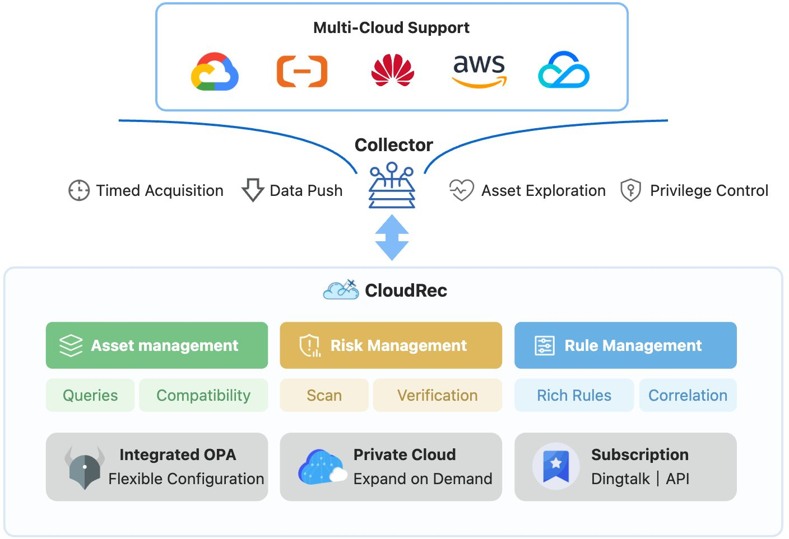

# README

# CloudRec ☁️🛡️


> CloudRec is an open source multi-cloud security posture management (CSPM) platform designed to help organizations improve the security of their cloud environments. CloudRec provides an open and scalable cloud assets collection framework and an OPA-based rule management engine. Based on CloudRec, you can easily implement comprehensive asset collection, real-time security inspection, and risk event operation in an enterprise cloud environment.
>

 [📘 Docs](https://cloudrec.yuque.com/org-wiki-cloudrec-iew3sz/pfamgq) | [🎮 ](https://playground.cloudrec.com)[Demo](https://demo.cloudrec.cloud/) | [Community](#tM6xT)

---

# Features
+ [🔗Rich inspection rules](https://cloudrec.yuque.com/org-wiki-cloudrec-iew3sz/pfamgq/woi2erlkl5s4k4a1): In addition to the built-in high-risk rules, it provides a flexible rule configuration engine based on OPA and supports multiple asset association analysis.
+ [🔗Multi-Cloud support](https://cloudrec.yuque.com/org-wiki-cloudrec-iew3sz/pfamgq/wx0er2045iwivp03): Built-in support for Alibaba Cloud, AWS, GCP and other cloud service providers, and can expand proprietary cloud on demand; It also provides Collector collection framework, which can be expanded and support other cloud vendors on demand.
+ User-friendly page: Intuitive UI interface, convenient for users to carry out asset management, rule editing, risk operation, support multi-tenant

## 🌟 Modules
| Function Modules | Description  |
| --- | --- |
| **Resource Discovery** | Covers mainstream public cloud platforms, automatically discovers 30+ cloud services and 200+ resource types, provides framework-level supports, and can be easily expanded on demand.  |
| **Risk Detection** | Based on enterprise-level real-world rules, covering multiple scenarios such as network protection, identity security, security protection, data protection, and log auditing.  |
| **Policy Engine** | Declarative policy management based on OPA, which can be dynamically adjust without hard coding, and no need to re-deploy  |
| **Repair Closed Loop** | Integrated enterprise WeChat/DingTalk, alarm policy can be flexibly configured |


---

# 🚀 Quick Start
+ [Deploy CloudRec](https://cloudrec.yuque.com/org-wiki-cloudrec-iew3sz/pfamgq/go704k0gbkcs68fi)
+ [Source code depolyment](https://cloudrec.yuque.com/org-wiki-cloudrec-iew3sz/pfamgq/sqphoi2fdh60yz22)
+ [Developments](https://cloudrec.yuque.com/org-wiki-cloudrec-iew3sz/pfamgq/eak7h1k13xhsx9vy)

# 🏗 Architecture


# 📚 Key Concepts
## 📡 Collector
```yaml

# Collector name, if not configured, hostname will be used
AgentName: "Alibaba CloudHuawei Cloud,AWS,Tencent Cloud,GCP,Baidu Cloud Collector"
# The server URL, http://localhost:8080 is used by default, and can be adjusted according to actual conditions
ServerUrl: "http://localhost:8080"

# eg：@every 30s、@every 5m、@every 1h
# @every 5m means obtaining an account every five minutes. If the current task is finished, skip this task.
Cron: "@every 5m"

# If RunOnlyOnce is set to false, the program will be executed once immediately, but the program will not exit. It will be run regularly according to the Cron cycle.
# If RunOnlyOnce is set to true, the program will be executed once immediately and then exit.
RunOnlyOnce: false

# Access token, which is used to authenticate the request. You can get it from the server
AccessToken: "change your access token"

#  Deployment site. If the deployment site is configured as 'S1', only cloudAccount of this site can be obtained. If the deployment site is not configured, all cloudAccount can be obtained.
#  eg:["S1"]
#  eg:["S1","I2","TE"]
Sites: [  ]

# Pay attention to the risk error information. If the error message contains text, the risk will be submitted to the server
AttentionErrorTexts: [ "NoPermission", "NotAuthorized", "NotApplicable",
                       "Forbidden.RAM", "Forbidden", "Throttling.User", "Throttling", "InvalidAccessKeyId.NotFound", "ServiceUnavailable", "Forbidden" ]
```


## 📜 Rego Policy Sample
```javascript
package ecs_security_groups_misconfig
import rego.v1

default risk := false
risk if {
  has_public_address
  count(security_groups_misconfig) != 0
}

public_ip_address := input.Instance.PublicIpAddress.IpAddress
has_public_address if {
  count(public_ip_address) > 0
}

security_groups_misconfig contains sg_rule if {
  sg_rule := input.SecurityGroups[_].Permissions[_]
  parts := split(sg_rule.SourceCidrIp, "/")
  size := to_number(parts[1])
  size <= 8
  sg_rule.Direction == "ingress"
  sg_rule.Policy == "Accept"
}
```

# 🤝 How to contribute
<font style="color:rgb(31, 35, 40);">To check detailed guidelines for new contributions, please refer </font>[<font style="color:rgb(9, 105, 218);">contribution step</font>](https://cloudrec.yuque.com/org-wiki-cloudrec-iew3sz/pfamgq/ns30u6qus3oxrisc)<font style="color:rgb(9, 105, 218);"></font>

# **<font style="color:rgb(38, 38, 38);">📬</font>** Community
[https://discord.gg/WpWT9Q8BkD](https://discord.gg/WpWT9Q8BkD)

# 📜 LICENSE
This project uses the Apache-2.0 LICENSE, the full text of which is available in the LICENSE document. Commercial use is subject to supplementary terms.

